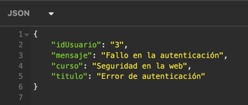
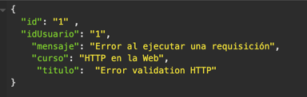

### Gestor de Tópicos Foro Hub

#### Descripción

Esta aplicación es un sistema que permite la gestión de tópicos en un foro, incluyendo el registro, visualización, actualización y eliminación de tópicos.

La aplicación está diseñada para garantizar la seguridad mediante autenticación JWT y utiliza Springboot junto a la base de datos MySQL. 

La API es ideal para proyectos que requieren manejar contenido generado por usuarios, con reglas estrictas de validación y control de acceso. 

#### Características principales

El sistema ofrece las siguientes funcionalidades: 

1. Gestión de tópicos: Registro, listado, actualización y eliminación de tópicos.
2. Autenticación JWT: Solo los usuarios autenticados pueden realizar operaciones críticas.
3. Endpoints públicos: Obtención de datos de un tópico y listado de tópicos. Para el desarrollo de este proyecto, se utilizó Insomnia
4. Base de datos relacional: Para persistir los datos, se utilizó MySQL con migraciones gestionadas a través de Flyway
5. Validación de datos: Reglas estrictas para evitar duplicados y garantizar la calidad del contenido

#### Diagrama de la base de datos

El proyecto consideró solamente 2 tablas en su desarrollo, incorporando las siguiente características: 

##### Tabla Usuario

- id (PK): Identificador único del usuario

- nombre: Nombre completo del usuario

- email: Dirección de correo electrónico (único)

- contrasena: Contraseña encriptada

##### Tabla Tópicos

- id (PK): Identificador único del tópico.

- titulo: Título del tópico.

- mensaje: Mensaje del tópico.

- fecha_creacion: Fecha de creación del tópico.

- status: Estado del tópico (activo/inactivo).

- autor_id (FK): Referencia al usuario que creó el tópico.

- curso: Curso asociado al tópico.

#### Dependencias Incluidas
- Lombok
- SpringWeb
- Springboot DevTools
- Spring Data JPA
- Flyway Migration
- MySQL Driver
- Validation
- Spring Security

#### EndPoints

##### Registrar un nuevo Tópico
- Método: Post 
- URI: /topicos
- Descripción: Permite registrar un nuevo tópico en la base de datos.
- Cuerpo de la solicitud:

- Reglas del negocio:

  - Todos los campos son obligatorios.
  - No se permite registrar tópicos con el mismo título y mensaje.

##### Obtener Datos de un Tópico

- Método: GET

- URI: /topicos/{id}

- Descripción: Devuelve los detalles de un tópico específico.

- Respuesta ejemplo:

##### Listar todos los tópicos
- Método: GET

- URI: /topicos

- Descripción: Devuelve una lista de todos los tópicos registrados.

- Respuesta ejemplo:

##### Actualizar un tópico
- Método: PUT

- URI: /topicos/{id}

- Descripción: Actualiza los datos de un tópico existente.

- Cuerpo de la solicitud:

- Reglas de negocio:

  - Todos los campos son obligatorios.

  - Es obligatorio indicar el id en la URI.

##### Eliminar un Tópico

- Método: DELETE

- URI: /topicos/{id}

- Descripción: Elimina un tópico específico.

- Reglas de negocio:

  - Es obligatorio indicar el id en la URI.

#### Autenticación
La API utiliza autenticación basada en tokens JWT para garantizar la seguridad. Solo los usuarios autenticados pueden realizar operaciones críticas como registrar, actualizar o eliminar tópicos.

- Endpoints públicos:

  - /topicos

  - /topicos/{id}
  

- Generación de Token:

  - Método: POST

  - URI: /auth/login

- Cuerpo de la solicitud:

- Respuesta ejemplo:

- Duración del token: 2 horas.

- Algoritmo utilizado: HMAC256.

#### Requisitos previos

- Java 17 o superior.
- Maven versión 4 en adelante
- Springboot versión 3 en adelante
- MySQL version 8 en adelante. Instalado y configurado.
- IDE. En este caso, utilizamos Intellij IDEA
- Herramienta para probar APIs como Postman o Insomnia.
- Clave secreta para generación de tokens JWT.

#### Instalación
1. Clona este repositorio:

   git clone <Challenge3ForoHub>
2. Configura las propiedades del proyecto en application.properties:

3. Ejecuta las migraciones de Flyway
4. Inicia la aplicación
5. Es importante que crees un usuario en la base de datos, para que puedas realizar las requisiciones. Una vez persistido el usuario, se recomienda pasar la contraseña por un algoritmo de hashing Bcrypt.

#### Pruebas

Puedes utilizar herramientas como Postman o Insomnia para probar los endpoints de la API. Asegúrate de incluir el token en los encabezados de las solicitudes autenticadas. 
